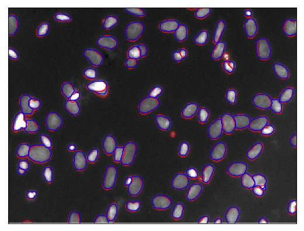
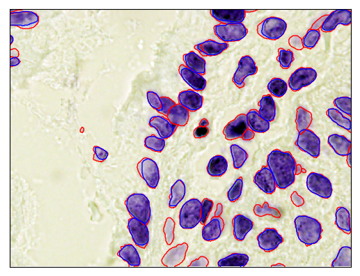
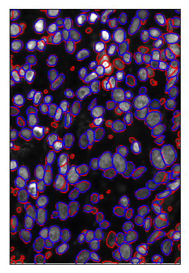
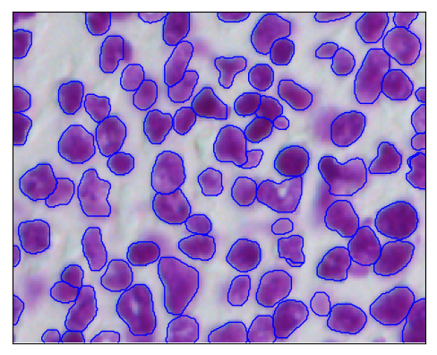
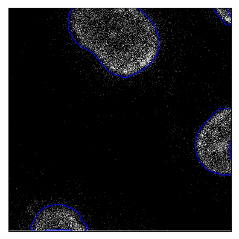

# The 2018 Data Science Bowl: "Spot Nuclei. Speed Cures."

This repository contains scripts of my solution to [The 2018 Data Science Bowl](https://www.kaggle.com/c/data-science-bowl-2018). Goal of the competition was to create an algorithm to automate nucleus detection from biomedical images.

Weights are now available [here](https://www.dropbox.com/s/1kql7tsug876xfn/kaggle_bowl.h5?dl=0).

## Model overview

For this competition, I modified [Matterport's](https://github.com/matterport/Mask_RCNN) implementation of [Mask-RCNN](https://arxiv.org/abs/1703.06870) deep neural network for object instance segmentation. I adapted the existing model configurations to detect small nuclei in images with varying size and modality. To ensure that the model doesn't overfit, I used an [external dataset](https://www.kaggle.com/voglinio/external-h-e-data-with-mask-annotations) and relied heavily on image augmentation. Moreover, generated mosaics from train images based on [this notebook](https://www.kaggle.com/bonlime/train-test-image-mosaic). To improve generalizability of the model, I split (using stratification) the `stage1_train` dataset into train and validation sets based on 5 image modalities provided by [Allen Goodman](https://www.kaggle.com/c/data-science-bowl-2018/discussion/48130). After training the model using Resnet101 as a backbone encoder and Adam as an optimizer, I improved prediction accuracy by test time augmentation and post-processing the masks.

## Training Method(s)

### Pre-processing
- I noticed some issues with the provided masks. Therefore, used the annotations and mask provided by [Konstantin Lopuhin](https://github.com/lopuhin/kaggle-dsbowl-2018-dataset-fixes) in [data quality issues](https://www.kaggle.com/c/data-science-bowl-2018/discussion/47572) thread.
- Removed the alpha channel from the images.
- Filled holes in the masks
- Split (using stratification) the `stage1_train` dataset into 90% train and 10% validation sets based on 5 image modalities provided by [Allen Goodman](https://www.kaggle.com/c/data-science-bowl-2018/discussion/48130).
- Used an [external dataset](https://www.kaggle.com/voglinio/external-h-e-data-with-mask-annotations) provided in the forum. Divided the images and the masks into 4 pieces due their large sizes. External dataset [download links](https://nucleisegmentationbenchmark.weebly.com/dataset.html).
- Generated mosaics from train images based on [Emil's](https://www.kaggle.com/bonlime/train-test-image-mosaic) notebook.

### Model and Training
* Modified [Matterport's](https://github.com/matterport/Mask_RCNN) implementation of [Mask-RCNN](https://arxiv.org/abs/1703.06870) deep neural network for object instance segmentation.
* Tuned hyperparameters to detect small nuclei from the images. (I found [this tutorial](https://engineering.matterport.com/splash-of-color-instance-segmentation-with-mask-r-cnn-and-tensorflow-7c761e238b46) very useful for understanding the model hyperparameters)
    + Original Matterport implementation was validating only on one image so fixed this [validation issue](https://github.com/matterport/Mask_RCNN/issues/89).
    + Reduced RPN (region proposal network) anchor sizes since the nuclei are mostly small.
    + Increased number of anchors to be used since the nuclei are small and can be found anywhere on an image.
    + Increased maximum number of predicted objects since an image can contain 300 or more nuclei.
    + Increased `POST_NMS_ROIS_TRAINING` to get more region proposals during training.
    + Added extra parameter `DETECTION_MASK_THRESHOLD` to model configuration. Default was hardcoded in the model as 0.5 but setting it to 0.35 helped in detection of small nuclei boundaries.
    + Resized images and masks to 512x512
* Relied heavily on image augmentation due to small training set:
    - Random horizontal or vertical flips
    - Random 90 or -90 degrees rotation
    - [Random rotations](https://www.kaggle.com/c/data-science-bowl-2018/discussion/49692) in the range of (-15, 15) degrees
    - [Random cropping](https://www.kaggle.com/c/data-science-bowl-2018/discussion/49692) of bigger images and masks to 256x256x3.
    - [Random scaling](https://www.kaggle.com/c/data-science-bowl-2018/discussion/49692) of image and mask scaling in the range (0.5, 2.0)

* Used Resnet101 architecture as a backbone encoder but initialized the first 50 layers of the model with pre-trained Resnet50 weights from [ImageNet competition](https://github.com/fchollet/deep-learning-models/releases/).
* Trained the model with [Adam](https://arxiv.org/abs/1412.6980) optimizer for 75 epochs:
    - 25 epochs with learning rate 1e-4
    - 25 epochs with learning rate 1e-5
    - 25 epochs with learning rate 1e-6
* Did not retrain the model with stage1 test data during stage 2 as I was afraid of overfitting on black and white images.

### Post-processing

- Combined predictions on actual image and horizontally flipped image: took unions of masks with maximum overlap and removed false positive masks with small overlap.
- Due to configured RPN anchor sizes, the model predicts small nuclei very well. However, it struggles at predicting large nuclei. Therefore, if a model predicts no masks for an image then I scale down the image and predict once again.
- Removed overlaps between predicted nuclei based on their objectness score. In other words, removed intersections from the masks with lower scores.
    - If this intersection removal results in multiple objects in that mask, then removing all the small pieces.
- Closing small holes inside the masks using morphological operations (dilation followed by erosion).

## Interesting findings

- Mask-RCNN model overfits easily without image augmentation.
- Removing false positive mask predictions improves the overall score significantly.
- Since images are on different scales, predicting masks on scaled images helps with the model generalizability.
- Dilating and then eroding individual masks helped me achieve slightly better result.
- Matterport's original implementation was only [validating on only one image](https://github.com/matterport/Mask_RCNN/issues/89). Fixing this issue made the training process reproducible.
- I found that the model reaches a local minima faster when trained using Adam optimizer compared to default SGD optimizer.

## Unsuccessful approaches tried
- Trained the model with Dice Coefficient Loss instead of default binary cross-entropy loss for the masks heads. Although got comparable results couldn't beat prediction accuracy of binary cross-entropy on my validation set.
- Trained with random Gaussian and Poisson (or shot) noise for image augmentation. It actually hurt overall model performance.
- Tried ensembling actual image predictions with horizontal and vertical flip predictions. Used non-maximum suppression for removing overlaps. Did not improve prediction accuracy on the validation set.
- Trained end-to-end without initializing with pre-trained ImageNet weights. Mostly got to Mean IoU score of 0.35 on stage1 test set.
- Trained on preprocessed images with adaptive histogram equalization (CLAHE). The model performed way worse.

## Example model predictions

For the following figures red lines represent ground truth boundaries and blue lines represent prediction boundaries.

* Model predictions for some stage 1 test image samples:

* Model predictions for some stage 2 test image samples:

# Appendix

## A1. Model Execution Time

The following execution times are measured on Nvidia P100 GPUs provided by [Ohio Supercomputer Center](https://www.osc.edu/)

+ Each training epoch takes about 12 minutes.
+ It takes about 15 hours to train the model from scratch.
+ It takes 1 to 4 seconds to predict all the nuclei on a single image.
+ Plotting boundaries of each nuclei and saving plots adds an extra 1 second on average

## A2. Dependencies

The codes are written in Python (3.6.3) and tested on  Red Hat Enterprise Linux Server (7.4). The scripts depend on the following python libraries available on `PyPi`:

* `tensorflow (1.3.0), keras (2.1.3), numpy (1.13.3), scipy (0.19.1)` for computations
* `cv2 (3.4.0), skimage (0.13.0), matplotlib (2.1.0)` for image processing and plotting
* `tqdm (4.11.2)` for progress bar

## A3.  How To Generate the Solution

1. Download/extract/place the training (external dataset [download links](https://nucleisegmentationbenchmark.weebly.com/dataset.html) ) datasets in the following folder structure:

~~~~~~~
        project
          |-- codes
          |-- data
               |--- stage1_train
                    |-- imageID
                          |-- images
                          |--- masks
               |-- stage1_test
                    |-- similar to stage1_train
               |-- stage2_test
                    |-- similar to stage1_train
               |-- external_data
                    |-- tissue_images
                          |-- imageID.tif
                    |-- annotations
                          |-- imageID.xml
~~~~~~~

2. Run `python augment_preprocess.py` to pre-process external data and create mosaics from the dataset. (You can skip this step if you only want to train on provided train set)

3. Run `python train.py` to train the model. Model weights are saved at `../data/logs/kaggle_bowl/mask_rcnn.h5`.

4.  Run `python predict.py` to evaluate model performance on validation set and predict nuclei boundaries on test set.

### Acknowledgements

* This material is based upon work supported by the National Science Foundation under Agreement No. 0931642 ([The Ohio Supercomputer Center](https://www.osc.edu/))
* I would like to also thank [Mathematical Biosciences Institue](http://mbi.osu.edu) (MBI) at Ohio State University, for partially supporting this research. MBI receives its funding through the National Science Foundation grant DMS 1440386

[1]: https://github.com/matterport/Mask_RCNN
[2]: https://www.osc.edu/
[3]: https://arxiv.org/abs/1703.06870
[4]: https://www.kaggle.com/voglinio/external-h-e-data-with-mask-annotations
[5]: https://www.kaggle.com/c/data-science-bowl-2018/discussion/48130
[6]: https://github.com/matterport/Mask_RCNN/issues/89
[7]: https://engineering.matterport.com/splash-of-color-instance-segmentation-with-mask-r-cnn-and-tensorflow-7c761e238b46
[8]: https://www.kaggle.com/bonlime/train-test-image-mosaic
[10]: https://nucleisegmentationbenchmark.weebly.com/dataset.html
[11]: http://mbi.osu.edu
[12]: http://www.lerner.ccf.org/thor/scott/lab/
[13]: https://promise12.grand-challenge.org
[14]: https://www.kaggle.com/c/data-science-bowl-2018/discussion/47572
[15]: https://github.com/lopuhin/kaggle-dsbowl-2018-dataset-fixes
[16]: https://github.com/fchollet/deep-learning-models/releases/
[17]: https://arxiv.org/abs/1412.6980
[18]: https://www.kaggle.com/c/data-science-bowl-2018/discussion/49692
[19]: https://nucleisegmentationbenchmark.weebly.com/dataset.html
[20]: https://github.com/matterport/Mask_RCNN/issues/89
